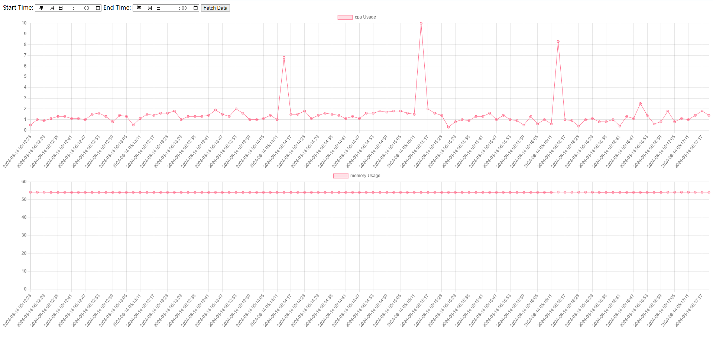

# monitor监控

可以监控linux服务器的CPU和内存占用情况，支持历史监控查询（个人自用，功能比较简单，后续可能会优化）。
使用docker部署，使用supervisord进行进程管理。

> 项目代码大部分由AI生成。

## 运行环境
- python3.9.0

### 本地启动
```
# 环境配置
pip install --index-url=https://mirrors.aliyun.com/pypi/simple/ --no-cache-dir -r requirements.txt
# 启动采集
python data_collector.py
# 启动web
python app.py
```

### 打包部署（docker）
```
# 打包镜像
docker build -t monitor:0.0.3 . --progress=plain
# 另存镜像
docker save -o monitor003.tar monitor:0.0.3
# 加载镜像
docker load -i monitor-0.0.3.tar
# 启动镜像
docker run -d -p 5000:5000 --name monitor003 --mount type=bind,src=/proc,dst=/host/proc -dit --restart=always monitor:0.0.3
```

访问地址：http://localhost:5000/


